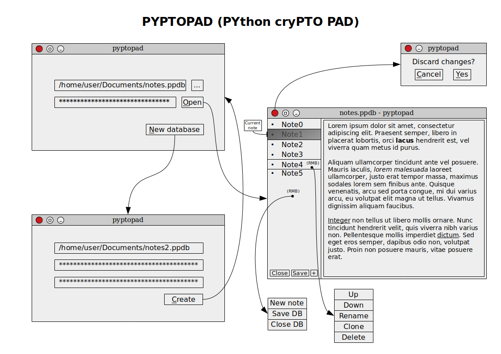

# PYPTOPAD (PYthon cryPTO PAD)
## Project description

Make your notes secure again!

Pyptopad is (going to be) a simple tool for storing your text notes safe.

Write down your thoughts, love letters or shopping list, save&close — and sleep well, because (hopefully) nobody can read your secrets!

## Disclaimer
No warranty, as is and all this crap. Hey, we are not cryptographers, we are just a couple of sophomores who've got to make something for their python course.

Bro, if you are looking for an app for organizing a transatlantic cocaine trafficking, pyptopad is probably not your best choice.

## Installation
work in progress

## Usage
work in progress

## FAQ
### Is pyptopad secure?
See the disclaimer.

### I forgot my password. Can I reset it?
No.

### How exactly are my notes encrypted?
While designing pyptopad, we kept in mind the golden rule of cryptography: "Don't roll your own crypto", so we wanted to write by yourselves as little crypto-related code as possible and use existing crypto solutions wherever possible.

But what if cypto library of our choice [turns out to be broken](https://en.wikipedia.org/wiki/Heartbleed)? Or [so does the encryption algorithm](https://en.wikipedia.org/wiki/RC4)? [Or the hash function](https://en.wikipedia.org/wiki/MD5)? We couldn't put all our eggs in one basket.

For this reason, pyptopad encryption relies on **three independent implementations** of **three different encryption algorithms**. Thus, if at least one of them isn't broken — cryptography primitives are probably not the weak link in pyptopad.

So, your pyptopad database is encrypted with three-layer encryption (our hope is that no three-letter organization has exploits to all of these):
* *Layer 1*: [Fernet module](https://cryptography.io/en/latest/fernet/) from the [pyca/cryptography library](https://cryptography.io/en/latest/). It uses [AES](https://en.wikipedia.org/wiki/Advanced_Encryption_Standard) for encryption and [SHA256](https://en.wikipedia.org/wiki/SHA-256)-based [HMAC](https://en.wikipedia.org/wiki/HMAC) for authentication.
* *Layer 2*: [Kuznyechick cipher](https://en.wikipedia.org/wiki/Kuznyechik) in [CFB mode](https://en.wikipedia.org/wiki/Block_cipher_modes_of_operation#Cipher_Feedback_(CFB)) from the [pygost library](http://pygost.cypherpunks.ru/). Kuznyechick is a Russian encryption algorithm defined in the National Standard of the Russian Federation **GOST R 34.12-2015**. Sorry, NSA.
* *Layer 3*: [SecretBox module](https://pynacl.readthedocs.io/en/stable/secret/) from the [PyNaCl library](https://pynacl.readthedocs.io/en/stable/). It uses [Salsa20 stream cipher](https://en.wikipedia.org/wiki/Salsa20) for encryption and [Poly1305 MAC](https://en.wikipedia.org/wiki/Poly1305-AES) for authentication.

Each of the ciphers uses its own key. All encryption keys are mutually independent, even though they are derived from a single password. For our Fernet-GOST-PyNaCl cascade, the key derivation function is instructed to derive a 768-bit encryption key from a given password. The generated 768-bit key is then split into three 256-bit keys, out of which the first key is used by Fernet, the second key is used by GOST, and the third one by PyNaCl. Hence, even when an adversary has one of the keys, he cannot use it to derive the other keys, as there is no feasible method to determine the password from which the key was derived (except for brute force attack mounted on a weak password).

For key derivation pyptopad also uses cascade of three different [KDF](https://en.wikipedia.org/wiki/Key_derivation_function) implementations: [Argon2i](https://en.wikipedia.org/wiki/Argon2) based [kdf from the PyNaCl library](https://pynacl.readthedocs.io/en/stable/password_hashing/#key-derivation), [GOST R 34.11-2012 (Streebog)](https://en.wikipedia.org/wiki/Streebog) based PBKDF2 function from the [pygost library](http://pygost.cypherpunks.ru/) and, finally, [SHA256](https://en.wikipedia.org/wiki/SHA-256)-based [PBKDF2HMAC from the pyca/cryptography library](https://cryptography.io/en/latest/hazmat/primitives/key-derivation-functions/#cryptography.hazmat.primitives.kdf.pbkdf2.PBKDF2HMAC).

The number of iterations in each KDF depends on choosen security level. Higher security level means more security against brute-force attacks, but also more time for decryption.

256+256+128=640-bit salt is used, which means there are 2^640 keys for each password. This significantly decreases vulnerability to 'off-line' dictionary/'rainbow table' attacks (pre-computing all the keys for a dictionary of passwords is very difficult when a salt is used). The salt consists of random values generated by python's [os.urandom()](https://docs.python.org/3.5/library/os.html#os.urandom) during the database creation process.

### Wow, so much crypto... But what if bad guys just guess my password?
We are trying to make brute-force attacks harder, but if you chose your name and date of birth as your pass, only euthanasia can help you. See [here](https://www.whonix.org/wiki/Passwords) for a guide on choosing a good password.

### How can I trust you?
You can't.

But pyptopad is Free (as in freedom) and Open-Source Software, so nothing stops you from looking through it's source code, luckily it's not gonna be huge.

### Were there any independent security audits of pyptopad?
Lol no.

### Wait, you are russkies, right? There MUST be FSB backdoors!
Maybe, who knows.

## Developers
* [Kirill Liolich](https://github.com/yitaxede/), group 241
* [Ilya Babkin](https://github.com/midmedian/), group 241
